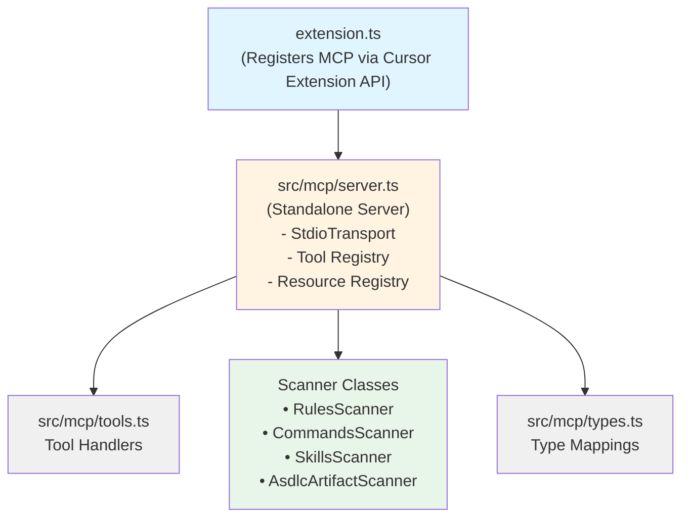

# Feature: MCP Server Integration

> **ASDLC Pattern**: [The Spec](https://asdlc.io/patterns/the-spec/)
> **Status**: Active
> **Last Updated**: 2026-02-07

---

## Blueprint

### Context

The MCP (Model Context Protocol) server exposes ACE's scanning capabilities as **tools** and **resources** that AI agents can invoke dynamically. Instead of static JSON exports, agents can request context on-demand through structured tool calls.

**Problem solved**: AI agents need dynamic access to project context (rules, commands, skills, ASDLC artifacts) without requiring static export files that become stale. MCP provides a standardized protocol for context access.

**Design principle**: MCP server is a **thin wrapper** around scanners. It translates MCP tool calls into scanner invocations and formats results according to MCP protocol. No business logic - just protocol adaptation.

### Architecture

#### MCP Server Components



#### Dual Integration Modes

**Mode 1: Cursor Extension API (Preferred)**
- Extension registers MCP via `vscode.mcp.registerServer()`
- No subprocess needed - runs in extension host
- Tools automatically available in Cursor chat
- Seamless integration

**Mode 2: Standalone Server (Fallback)**
- Runs as subprocess via stdio transport
- Configured in `.cursor/mcp.json` or `~/.cursor/mcp.json`
- Works with non-Cursor IDEs or when Extension API unavailable
- Requires explicit server path and workspace path

### Tool Registry

| Tool | Description | Input | Output |
|------|-------------|-------|--------|
| `list_rules` | List all Cursor rules | `projectPath?` | `RuleInfo[]` |
| `get_rule` | Get full rule content | `name`, `projectPath?` | `RuleContent` |
| `list_commands` | List workspace + global commands | `projectPath?` | `CommandInfo[]` |
| `get_command` | Get full command content | `name`, `projectPath?` | `CommandContent` |
| `list_skills` | List workspace + global skills | `projectPath?` | `SkillInfo[]` |
| `get_skill` | Get full skill content | `name`, `projectPath?` | `SkillContent` |
| `get_asdlc_artifacts` | Get AGENTS.md, specs, schemas | `projectPath?` | `AsdlcArtifacts` |
| `list_specs` | List available specifications | `projectPath?` | `SpecFile[]` |
| `get_project_context` | Complete project context | `projectPath?` | `ProjectContext` |

**Tool Input Pattern**:
- All tools accept optional `projectPath` parameter
- If omitted, uses current workspace
- Enables multi-project context access

**Tool Output Pattern**:
- Returns JSON-serializable typed objects
- Empty results (e.g., no rules) return empty arrays, not errors
- Errors return `{ isError: true, message: string }`

### Resource Registry

Resources provide read-only URIs for static content:

| Resource URI | Description | Content Type | Status |
|--------------|-------------|--------------|--------|
| `ace://rules` | List of all rules | `application/json` | ✅ Implemented |
| `ace://rules/{name}` | Individual rule content | `text/markdown` | ✅ Implemented |
| `ace://commands` | List of all commands | `application/json` | ✅ Implemented |
| `ace://commands/{name}` | Individual command content | `text/markdown` | ✅ Implemented |
| `ace://skills` | List of all skills | `application/json` | ✅ Implemented |
| `ace://skills/{name}` | Individual skill content | `text/markdown` | ✅ Implemented |
| `ace://agents-md` | AGENTS.md content | `text/markdown` | ✅ Implemented |
| `ace://specs` | List of specs | `application/json` | ✅ Implemented |
| `ace://specs/{domain}` | Individual spec content | `text/markdown` | ✅ Implemented |
| `ace://schemas` | List of schemas | `application/json` | ✅ Implemented |
| `ace://schemas/{name}` | Individual schema content | `application/json` | ✅ Implemented |

### Type System

The MCP layer maintains its own type definitions that map to scanner types:

**Scanner → MCP Mapping**:
```typescript
// Scanner type (internal)
Rule { uri, fileName, metadata, content }

// MCP type (external)
RuleInfo { name, description, type, path, globs? }
RuleContent { ...RuleInfo, content }
```

**Design principle**: MCP types are **flattened and simplified** for agent consumption. Internal complexity (URI objects, VS Code types) is hidden.

### Anti-Patterns

#### ❌ Business Logic in MCP Layer
**Problem**: Adding validation, transformation, or complex logic in MCP server.
**Why it fails**: MCP should be a thin protocol adapter. Logic belongs in scanners.
**Solution**: MCP tools simply call scanner methods and format results.

#### ❌ Caching Scanner Results
**Problem**: Storing scanner results in memory to avoid re-scanning.
**Why it fails**: Stale data - files change frequently during development.
**Solution**: Always call scanners fresh. Scanners are fast enough for dynamic invocation.

#### ❌ Mixing Extension and Server Logic
**Problem**: Shared code between extension MCP registration and standalone server.
**Why it fails**: Different lifecycles - extension runs in host, server as subprocess.
**Solution**: Standalone server (`src/mcp/server.ts`) implements Node.js-based scanners independently.

---

## Contract

### Definition of Done

- [ ] MCP server registers successfully via Cursor Extension API
- [ ] Fallback standalone server runs via stdio transport
- [ ] All tools (`list_rules`, `get_rule`, etc.) callable from agent
- [ ] Tools return correct typed responses matching spec
- [ ] Resources accessible via `ace://` URIs
- [ ] `get_project_context` aggregates all scanner results
- [ ] Tools handle missing artifacts gracefully (empty results, not errors)
- [ ] Integration tests verify tool invocations and responses

### Regression Guardrails

**Critical invariants that must never break:**

1. **Stateless tools**: Tools MUST NOT maintain state between invocations. Always scan fresh.

2. **Error handling**: Tools MUST return `{ isError: true, message }` for errors, never throw uncaught exceptions.

3. **Type consistency**: Tool outputs MUST match declared MCP types exactly. No `any` or dynamic fields.

4. **Scanner independence**: MCP layer MUST NOT modify scanner behavior. Tools are adapters only.

5. **Empty vs Error**: Missing artifacts MUST return empty arrays/objects with `exists: false`, not errors.

### Scenarios

**Scenario: Agent requests all rules**
- **Given**: Workspace has 3 rules in `.cursor/rules/`
- **When**: Agent invokes `list_rules` tool
- **Then**: Returns array of 3 `RuleInfo` objects with name, description, type, path

**Scenario: Agent requests specific rule**
- **Given**: Rule `security.mdc` exists with content
- **When**: Agent invokes `get_rule` with `name: "security"`
- **Then**: Returns `RuleContent` with full content and metadata

**Scenario: Agent requests rule that doesn't exist**
- **Given**: No rule named `missing.mdc`
- **When**: Agent invokes `get_rule` with `name: "missing"`
- **Then**: Returns `null` (not error)

**Scenario: Agent requests complete project context**
- **Given**: Workspace has rules, commands, skills, and AGENTS.md
- **When**: Agent invokes `get_project_context`
- **Then**: Returns `ProjectContext` with all artifacts, timestamp, and projectPath

**Scenario: Agent accesses resource URI**
- **Given**: AGENTS.md exists at workspace root
- **When**: Agent reads `ace://agents-md` resource
- **Then**: Returns full AGENTS.md content as text/markdown

**Scenario: Agent lists available skills**
- **Given**: Workspace has 3 skills in `.cursor/skills/`
- **When**: Agent reads `ace://skills` resource
- **Then**: Returns JSON array with 3 skill objects (name, title, overview, location, path)

**Scenario: Agent reads specific skill**
- **Given**: Skill `create-plan` exists with SKILL.md content
- **When**: Agent reads `ace://skills/create-plan` resource
- **Then**: Returns full SKILL.md content as text/markdown

**Scenario: Multi-project context access**
- **Given**: Multiple projects configured in ACE
- **When**: Agent invokes tool with `projectPath: "/other/project"`
- **Then**: Returns context for specified project, not current workspace

---

## Implementation Reference

### Files

| Component | Location |
|-----------|----------|
| Extension MCP registration | `src/extension.ts` |
| Standalone MCP server | `src/mcp/server.ts` |
| MCP tool handlers | `src/mcp/tools.ts` |
| MCP type definitions | `src/mcp/types.ts` |

### Configuration

**Cursor Extension API** (automatic):
```typescript
// src/extension.ts
vscode.mcp.registerServer('ace', {
  name: 'Agent Context Explorer',
  description: 'Project context tools'
});
```

**Standalone Server** (manual):
```json
// .cursor/mcp.json or ~/.cursor/mcp.json
{
  "mcpServers": {
    "ace": {
      "command": "node",
      "args": ["<extension-dir>/out/mcp/server.js", "<workspace-root>"]
    }
  }
}
```

### Tests

| Test Suite | Location |
|------------|----------|
| MCP server scanners | `test/suite/unit/mcpServer.test.ts` |
| MCP types | `test/suite/unit/mcpTypes.test.ts` |

---

**Status**: Active
**Last Updated**: 2026-02-07
**Pattern**: ASDLC "The Spec"
