# Feature: Tree View Providers

> **ASDLC Pattern**: [The Spec](https://asdlc.io/patterns/the-spec/)
> **Status**: Active
> **Last Updated**: 2026-02-07

---

## Blueprint

### Context

Tree view providers translate project artifacts (rules, commands, skills, ASDLC artifacts) into the hierarchical UI displayed in VS Code's sidebar. The tree view is the primary interface for browsing project context.

**Problem solved**: Users need an organized, hierarchical view of project context. Flat file lists are hard to navigate. Providers structure artifacts by type, location (workspace/global), and category.

**Design principle**: **Platform-first organization**. Group artifacts by platform (Cursor IDE) and paradigm (ASDLC) to future-proof for multi-platform support (Claude Desktop, Windsurf, etc.).

### Architecture

#### Tree Hierarchy (FB-57 Platform-First Structure)

```mermaid
graph TB
    Root["Current Workspace"]
    Cursor["📁 Cursor"]
    Agents["📁 Agents (ASDLC)"]
    
    Commands["📁 Commands"]
    Rules["📁 Rules"]
    Skills["📁 Skills"]
    Subagents["📁 Subagents<br/>(Coming soon)"]
    
    CmdWorkspace["📁 Workspace Commands"]
    CmdGlobal["📁 Global Commands"]
    CmdFile1["create-plan.md"]
    CmdFile2["deploy.md"]
    
    RulesAlways["📂 Always Apply"]
    RulesAuto["📂 Auto (Glob-based)"]
    RulesManual["📂 Manual"]
    RuleFile1["security.mdc"]
    RuleFile2["typescript.mdc"]
    RuleFile3["testing.mdc"]
    
    SkillsWorkspace["📁 Workspace Skills"]
    SkillsGlobal["📁 Global Skills"]
    SkillFile1["create-spec"]
    SkillFile2["start-task"]
    
    AgentsMd["📄 AGENTS.md"]
    Specs["📁 Specs"]
    Schemas["📁 Schemas"]
    SpecFile1["scanners/spec.md"]
    SpecFile2["mcp/spec.md"]
    SchemaFile["config.json"]
    
    Root --> Cursor
    Root --> Agents
    
    Cursor --> Commands
    Cursor --> Rules
    Cursor --> Skills
    Cursor --> Subagents
    
    Commands --> CmdWorkspace
    Commands --> CmdGlobal
    CmdWorkspace --> CmdFile1
    CmdGlobal --> CmdFile2
    
    Rules --> RulesAlways
    Rules --> RulesAuto
    Rules --> RulesManual
    RulesAlways --> RuleFile1
    RulesAuto --> RuleFile2
    RulesManual --> RuleFile3
    
    Skills --> SkillsWorkspace
    Skills --> SkillsGlobal
    SkillsWorkspace --> SkillFile1
    SkillsGlobal --> SkillFile2
    
    Agents --> AgentsMd
    Agents --> Specs
    Agents --> Schemas
    Specs --> SpecFile1
    Specs --> SpecFile2
    Schemas --> SchemaFile
    
    style Root fill:#e1f5ff
    style Cursor fill:#fff4e1
    style Agents fill:#f3e5f5
```



**Design rationale**:
- **Cursor section**: IDE-specific artifacts (rules, commands, skills, subagents)
- **Agents section**: Paradigm-agnostic ASDLC artifacts (AGENTS.md, specs, schemas)
- **Future-proof**: Easy to add "Claude Desktop" or "Windsurf" sections alongside Cursor
- **Clarity**: Clear separation between IDE tools and development methodology

#### Provider Pattern

```typescript
class ProjectTreeProvider implements vscode.TreeDataProvider<ProjectTreeItem> {
  // Core TreeDataProvider methods
  getChildren(element?: ProjectTreeItem): Promise<ProjectTreeItem[]>
  getTreeItem(element: ProjectTreeItem): vscode.TreeItem

  // Refresh mechanism
  refresh(): void
  private _onDidChangeTreeData: vscode.EventEmitter<void>

  // Data management
  updateData(
    projectData: Map<string, ProjectData>,
    projects: ProjectDefinition[],
    currentProject: ProjectDefinition | null
  ): void
}
```

**Key characteristics**:
- Implements VS Code's `TreeDataProvider<T>` interface
- Stateful: Holds `projectData` map with scanner results
- Event-driven: Fires `onDidChangeTreeData` to trigger refresh
- Lazy loading: `getChildren()` only loads visible nodes

#### ProjectTreeItem Structure

```typescript
interface ProjectTreeItem extends vscode.TreeItem {
  // Artifact data (mutually exclusive)
  rule?: Rule
  commandData?: Command
  skillData?: Skill
  stateItem?: any

  // Category classification
  category?: 'cursor' | 'agents' | 'rules' | 'commands' | 'skills' |
            'commands-workspace' | 'commands-global' |
            'skills-workspace' | 'skills-global' |
            'agents-md' | 'specs' | 'schemas' | 'subagents'

  // Location metadata
  commandLocation?: 'workspace' | 'global'
  skillLocation?: 'workspace' | 'global'

  // Hierarchy context
  ruleType?: { type: 'always' | 'glob' | 'manual' }
  directory?: string
  project?: ProjectDefinition
}
```

**Design principle**: **Single item type with tagged unions**. One `ProjectTreeItem` type with optional fields based on `category`. Avoids class hierarchy complexity.

### Category System

Categories define tree node types and determine children resolution:

| Category | Parent | Children | Purpose |
|----------|--------|----------|---------|
| `'projects'` | Root | `'cursor'`, `'agents'` | Top-level project node |
| `'cursor'` | `'projects'` | `'commands'`, `'rules'`, `'skills'`, `'subagents'` | Cursor IDE section |
| `'agents'` | `'projects'` | `'agents-md'`, `'specs'`, `'schemas'` | ASDLC section |
| `'commands'` | `'cursor'` | `'commands-workspace'`, `'commands-global'` | Commands section |
| `'skills'` | `'cursor'` | `'skills-workspace'`, `'skills-global'` | Skills section |
| `'rules'` | `'cursor'` | `'always'`, `'glob'`, `'manual'` rule types | Rules section |
| `'commands-workspace'` | `'commands'` | Individual command items | Workspace commands |
| `'commands-global'` | `'commands'` | Individual command items | Global commands |
| `'skills-workspace'` | `'skills'` | Individual skill items | Workspace skills |
| `'skills-global'` | `'skills'` | Individual skill items | Global skills |
| `'specs'` | `'agents'` | Individual spec files | Specifications |
| `'schemas'` | `'agents'` | Individual schema files | JSON schemas |

### Data Flow

1. **Extension activates** → `ProjectTreeProvider` instantiated
2. **Scanner results updated** → Provider's `updateData()` called with new `projectData`
3. **Provider fires change event** → VS Code calls `getChildren()` to rebuild tree
4. **User expands node** → `getChildren(element)` returns children for that node
5. **User clicks item** → Item's `command` property executed (open file, view details)

### File Watchers

Automatic tree refresh when artifacts change:

```typescript
// extension.ts
const rulesWatcher = vscode.workspace.createFileSystemWatcher(
  '**/.cursor/rules/**/*.{mdc,md}'
);
const commandsWatcher = vscode.workspace.createFileSystemWatcher(
  '.cursor/commands/*.md'
);
const skillsWatcher = vscode.workspace.createFileSystemWatcher(
  '.cursor/skills/*/SKILL.md'
);

rulesWatcher.onDidChange(() => refreshData());
commandsWatcher.onDidChange(() => refreshData());
skillsWatcher.onDidChange(() => refreshData());
```

### Anti-Patterns

#### ❌ Deep Nesting
**Problem**: Tree hierarchy more than 4 levels deep becomes hard to navigate.
**Why it fails**: Users must click through many folders to reach content.
**Solution**: FB-57 reduced hierarchy from 5 levels to 3-4 max. Flatten when possible.

#### ❌ Mixed Abstraction Levels
**Problem**: Mixing file-level nodes with category nodes in same parent.
**Why it fails**: Confusing UX - users can't tell sections from content.
**Solution**: Always insert intermediate category nodes (Commands → Workspace Commands → files).

#### ❌ Stateless Provider
**Problem**: Re-scanning on every `getChildren()` call.
**Why it fails**: Slow tree expansion, high CPU usage.
**Solution**: Provider holds `projectData` map. Refresh only when files change.

#### ❌ Circular Dependencies
**Problem**: Provider importing from scanners, scanners importing from provider types.
**Why it fails**: Circular import errors, tight coupling.
**Solution**: Scanners export types in `scanner/types.ts`. Provider imports types only.

---

## Contract

### Definition of Done

- [ ] Tree view displays all artifact types (rules, commands, skills, ASDLC)
- [ ] Platform-first structure (Cursor / Agents top-level)
- [ ] Category system correctly routes `getChildren()` calls
- [ ] File watchers trigger automatic refresh when artifacts change
- [ ] Empty states display helpful messages ("No workspace skills found")
- [ ] Click-to-open works for all artifact types
- [ ] Multi-project support (switch between configured projects)
- [ ] Tree state persists across VS Code restarts (expansion state)

### Regression Guardrails

**Critical invariants that must never break:**

1. **Category consistency**: Every tree item MUST have a valid `category` that determines children resolution.

2. **Data immutability**: Provider MUST NOT mutate `projectData`. Scanners own data, provider displays it.

3. **Lazy loading**: `getChildren()` MUST only compute children for requested node, not entire tree.

4. **Event-driven refresh**: Tree MUST refresh via `onDidChangeTreeData` event, not polling.

5. **Empty gracefully**: Missing artifacts MUST show empty state, not hide section entirely.

### Scenarios

**Scenario: User expands Cursor section**
- **Given**: Project has rules, commands, and skills
- **When**: User expands "Cursor" node
- **Then**: Shows "Commands", "Rules", "Skills", "Subagents" subsections with correct counts

**Scenario: User expands Workspace Skills**
- **Given**: `.cursor/skills/` has 2 SKILL.md files
- **When**: User expands "Cursor > Skills > Workspace Skills"
- **Then**: Shows 2 skill items with titles from SKILL.md

**Scenario: User clicks a skill**
- **Given**: Skill "create-plan" exists
- **When**: User clicks skill item in tree
- **Then**: Opens `.cursor/skills/create-plan/SKILL.md` in editor

**Scenario: Skills directory is empty**
- **Given**: `.cursor/skills/` directory doesn't exist
- **When**: User expands "Cursor > Skills > Workspace Skills"
- **Then**: Shows "No workspace skills found" message with helpful description

**Scenario: File watcher triggers refresh**
- **Given**: Tree view is open with 2 rules visible
- **When**: User creates new rule `.cursor/rules/new.mdc`
- **Then**: Tree automatically refreshes and shows 3 rules

**Scenario: Multi-project context**
- **Given**: 2 projects configured in ACE
- **When**: User expands both projects in tree
- **Then**: Each project shows its own rules, commands, skills independently

**Scenario: AGENTS.md doesn't exist**
- **Given**: Workspace has no AGENTS.md file
- **When**: User expands "Agents" section
- **Then**: AGENTS.md item doesn't appear, but Specs and Schemas still shown if they exist

---

## Implementation Reference

### Files

| Component | Location |
|-----------|----------|
| ProjectTreeProvider | `src/providers/projectTreeProvider.ts` |
| Provider types | `src/providers/projectTreeProvider.ts` (interfaces at top) |
| Tree view registration | `src/extension.ts` |

### Tree View Registration

```typescript
// src/extension.ts
const treeDataProvider = new ProjectTreeProvider(projectData, projects, currentProject);

const treeView = vscode.window.createTreeView('aceExplorer', {
  treeDataProvider,
  showCollapseAll: true
});

context.subscriptions.push(treeView);
```

### Tests

| Test Suite | Location |
|------------|----------|
| Tree structure | `test/suite/ui/ruleLabels.test.ts` |
| Integration | `test/suite/integration/extension.test.ts` |

### Historical Context

**FB-52**: Initial pivot to Agent Context Explorer  
**FB-54**: Added ASDLC artifact scanning  
**FB-55**: Compliance audit (later removed in FB-66)  
**FB-56**: MCP server integration  
**FB-57**: Platform-first tree structure (Cursor / Agents)  
**FB-66**: Removed compliance and rules CRUD (viewer-only philosophy)

**Evolution**: Started with flat Commands/Rules/State structure → Added ASDLC section → Reorganized to Cursor/Agents platform-first model.

---

**Status**: Active
**Last Updated**: 2026-02-07
**Pattern**: ASDLC "The Spec"
