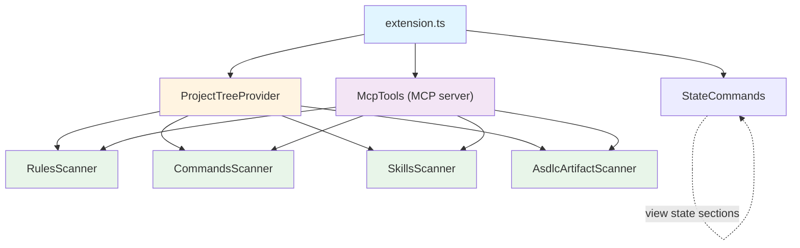

# Feature: Scanner Subsystem

> **ASDLC Pattern**: [The Spec](https://asdlc.io/patterns/the-spec/)
> **Status**: Active
> **Last Updated**: 2026-02-01

---

## Blueprint

### Context

Scanners provide project context to AI agents by detecting and parsing artifacts in the workspace. The extension needs to understand what a project contains (rules, commands, ASDLC artifacts) to present it in the tree view and provide it to AI agents via MCP tools.

**Problem solved**: AI agents lack persistent memory. Scanners extract explicit project context from intentional artifacts so agents can understand the codebase without inference.

**Design principle**: ACE is a **viewer of intentional artifacts**. Scan what developers intentionally create (AGENTS.md, specs/, rules/) rather than guessing from file patterns. Do not manage, validate, or create artifacts - that's the developer's responsibility.

### Architecture

#### Scanner Pattern

All scanners follow a consistent pattern:

```typescript
class XxxScanner {
  constructor(private workspaceRoot: vscode.Uri) {}

  async scanXxx(): Promise<XxxResult> {
    // 1. Check if artifact exists
    // 2. Parse content if found
    // 3. Return typed result (valid even when empty)
  }
}
```

**Key characteristics**:
- Constructor accepts `workspaceRoot` URI
- Async methods return typed results
- Uses `vscode.workspace.fs` for all file operations
- Graceful handling of missing artifacts (return empty result, not error)

#### Scanner Types

| Scanner | Artifacts | Location | Purpose |
|---------|-----------|----------|---------|
| `RulesScanner` | `.mdc`, `.md` files | `.cursor/rules/` | Cursor rules with YAML frontmatter |
| `CommandsScanner` | `.md` files | `.cursor/commands/`, `~/.cursor/commands/` | Workspace and global commands |
| `SkillsScanner` | `SKILL.md` files | `.cursor/skills/*/`, `~/.cursor/skills/*/` | Workspace and global skills (structured workflows) |
| `AsdlcArtifactScanner` | `AGENTS.md`, `spec.md`, `.json` | Root, `specs/`, `schemas/` | Explicit project context artifacts |

#### Dependency Direction



Scanners are instantiated by providers, commands, and MCP tools. Scanners have no dependencies on each other.

#### Data Flow

1. Extension activates → TreeProvider initializes scanners
2. TreeProvider calls `scanner.scanXxx()` → Scanner reads filesystem
3. Scanner returns typed result → Provider builds tree items
4. User triggers export → All scanner results combined into JSON

### Anti-Patterns

#### ❌ Optimistic Inference
**Problem**: Guessing project type from package.json patterns, file extensions, or directory names.
**Why it fails**: Produces unreliable results. A project with `express` dependency isn't necessarily an Express app.
**Solution**: Scan explicit artifacts that developers intentionally maintain (AGENTS.md, specs/).

#### ❌ Node.js fs Module
**Problem**: Using `fs.readFile()` or `fs.existsSync()` for file operations.
**Why it fails**: Breaks in VS Code web extensions, doesn't respect workspace trust.
**Solution**: Always use `vscode.workspace.fs` API.

#### ❌ Throwing on Missing Files
**Problem**: Throwing errors when expected artifacts don't exist.
**Why it fails**: Most projects won't have all artifacts. Extension should degrade gracefully.
**Solution**: Return valid empty result with `exists: false` flag.

#### ❌ Blocking Operations
**Problem**: Synchronous file reads or CPU-intensive parsing on main thread.
**Why it fails**: Blocks VS Code UI, causes extension host timeout.
**Solution**: All scanner methods are async. Use `vscode.workspace.fs` async API.

---

## Contract

### Definition of Done

- [ ] Scanner class follows the standard pattern (constructor with `workspaceRoot`, async methods)
- [ ] All file operations use `vscode.workspace.fs` API
- [ ] Scanner returns valid typed result even when artifacts are missing
- [ ] Scanner handles malformed files gracefully (returns partial result or placeholder)
- [ ] Unit tests cover: artifact found, artifact missing, malformed content
- [ ] Scanner integrated with `RulesTreeProvider` for tree view display

### Regression Guardrails

**Critical invariants that must never break:**

1. **Empty result, not error**: Scanners MUST return valid typed result when artifacts are missing. Never throw for missing files.

2. **VS Code filesystem API**: All file operations MUST use `vscode.workspace.fs`. Never use Node.js `fs` module.

3. **Typed returns**: Scanner methods MUST return strongly-typed results, not `any` or untyped objects.

4. **Graceful degradation**: Malformed files MUST NOT crash the scanner. Return partial data or placeholder with error indication.

5. **No inference**: `AsdlcArtifactScanner` MUST NOT infer project characteristics from patterns. Only scan explicit artifacts.

### Scenarios

**Scenario: Rules scanning with valid rules**
- **Given**: Workspace has `.cursor/rules/` with valid `.mdc` files
- **When**: `RulesScanner.scanRules()` is called
- **Then**: Returns array of `Rule` objects with parsed metadata and content

**Scenario: Rules scanning with no rules directory**
- **Given**: Workspace has no `.cursor/rules/` directory
- **When**: `RulesScanner.scanRules()` is called
- **Then**: Returns empty array (not error)

**Scenario: Commands scanning workspace and global**
- **Given**: Workspace has `.cursor/commands/` and user has `~/.cursor/commands/`
- **When**: Both `scanWorkspaceCommands()` and `scanGlobalCommands()` are called
- **Then**: Returns commands with correct `location` property ('workspace' or 'global')

**Scenario: Skills scanning workspace and global**
- **Given**: Workspace has `.cursor/skills/*/SKILL.md` and user has `~/.cursor/skills/*/SKILL.md`
- **When**: Both `scanWorkspaceSkills()` and `scanGlobalSkills()` are called
- **Then**: Returns skills with parsed metadata (title, overview, prerequisites, steps) and correct `location` property

**Scenario: Skills scanning with YAML frontmatter**
- **Given**: `SKILL.md` file has YAML frontmatter with title, overview, and other metadata
- **When**: `SkillsScanner.scanWorkspaceSkills()` is called
- **Then**: Returns `Skill` objects with parsed frontmatter in `metadata` property

**Scenario: ASDLC artifact scanning with AGENTS.md**
- **Given**: Workspace has `AGENTS.md` at project root
- **When**: `AsdlcArtifactScanner.scanAgentsMd()` is called
- **Then**: Returns `AgentsMdInfo` with `exists: true`, parsed sections, and extracted metadata

**Scenario: ASDLC artifact scanning with no artifacts**
- **Given**: Workspace has no AGENTS.md, no specs/, no schemas/
- **When**: `AsdlcArtifactScanner.scanAll()` is called
- **Then**: Returns `AsdlcArtifacts` with `hasAnyArtifacts: false` and all sub-results showing `exists: false`

**Scenario: Malformed MDC file**
- **Given**: `.cursor/rules/broken.mdc` has invalid YAML frontmatter
- **When**: `RulesScanner.scanRules()` is called
- **Then**: Returns `Rule` with error placeholder in metadata, does not throw

---

## Implementation Reference

### Files

| Component | Location |
|-----------|----------|
| RulesScanner | `src/scanner/rulesScanner.ts` |
| CommandsScanner | `src/scanner/commandsScanner.ts` |
| SkillsScanner | `src/scanner/skillsScanner.ts` |
| AsdlcArtifactScanner | `src/scanner/asdlcArtifactScanner.ts` |
| StateScanner (deprecated) | `src/scanner/stateScanner.ts` |
| Scanner types | `src/scanner/types.ts` |
| MDC parser utility | `src/utils/mdcParser.ts` |

### Tests

| Scanner | Test File |
|---------|-----------|
| RulesScanner | `test/suite/scanner/rulesScanner.test.ts` |
| CommandsScanner | `test/suite/unit/commandsScanner.test.ts` |
| SkillsScanner | `test/suite/unit/skillsScanner.test.ts` (planned) |
| AsdlcArtifactScanner | `test/suite/unit/asdlcArtifactScanner.test.ts` |
| StateScanner | `test/suite/scanner/stateScanner.test.ts` |
| MCP Server Scanners | `test/suite/unit/mcpServer.test.ts` |

---

## Deprecation Notes

### AsdlcComplianceScanner (Removed in FB-66)

`AsdlcComplianceScanner` performed ASDLC three-pillar compliance auditing. This was **removed in FB-66** as compliance validation is too opinionated for a general-purpose viewer extension.

**Reason for removal**: ACE's philosophy is "viewer of intentional artifacts" - displaying context, not validating it. Compliance auditing introduces opinions about what constitutes "good" ASDLC practices, which conflicts with the general-purpose nature of the extension.

**Migration path**: Removed entirely. Projects needing compliance validation should implement it externally as a custom command or separate tool.

### StateScanner (Deprecated)

`StateScanner` uses optimistic inference to detect project characteristics (databases, frameworks, cloud SDKs) from dependency patterns. This approach is unreliable and being replaced by `AsdlcArtifactScanner`.

**Migration path**:
1. FB-54: Create `AsdlcArtifactScanner` for explicit artifact scanning
2. Phase 3: Update tree view to use ASDLC artifacts
3. Phase 5: Remove `StateScanner` after all consumers migrated

**Do not add new features to StateScanner.**

---

**Status**: Active
**Last Updated**: 2026-02-07
**Pattern**: ASDLC "The Spec"
